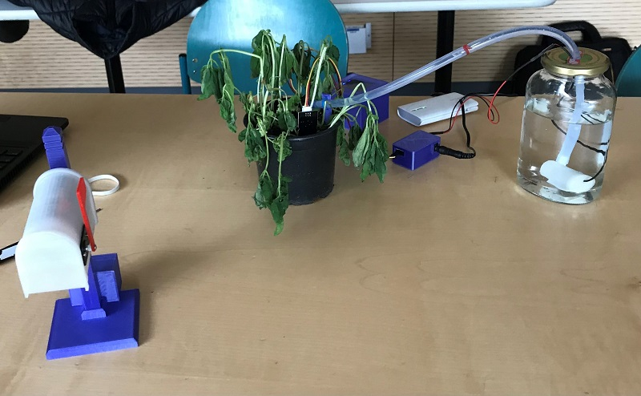
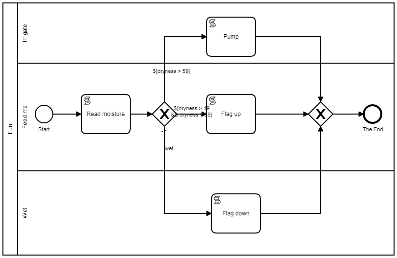

# Have fun with workflows



## Soil moisture
To measure to soil moisture, the [Sensor](https://www.amazon.de/AZDelivery-Bodenfeuchtesensor-Hygrometer-kapazitiv-Arduino/dp/B07HJ6N1S4?pf_rd_p=0f6687bc-b0cb-44d9-9696-138c1879ad4f&pd_rd_wg=qVeJu&pf_rd_r=G0MBB8D6FN4A0QK7HZCZ&ref_=pd_gw_cr_simh&pd_rd_w=ljE2b&pd_rd_r=f5ef5e3b-2ae1-4525-bbc8-39a60900a4d1) delivers an electrical voltage representing the moisture. This value is calibrated for water and air and a value for the dryness is calculated.

Dryness d     | Description
------------- | -------------
0 <= d <= 9   | saturated
9 < d <= 19   | adequately wet 
19 < d <= 59  | irrigation advice
59 < d <= 99  | irrigation
99 < d <= 100 | dangerously dry

## Mailbox
The mailbox is based on this [Adafruit project](https://learn.adafruit.com/gmailbox/3d-printing-the-mailbox).

## Pump
A [5V pump](https://www.amazon.de/Homengineer-Tauchpumpe-Brunnen-Bew%C3%A4sserung-Raspberry/dp/B07PGQNKKC/ref=asc_df_B07PGQNKKC/) is used for irrigation.

## Workflow 
The three devices are connected and controlled by a business workflow. 



### Read soil moisture

```javascript
var httpConnector = org.camunda.connect.Connectors.http(); 
var system = java.lang.System;

var resp = httpConnector.createRequest()
                                        .get()
                                        .url("http://192.168.0.40/soilmoisture")
                                        .execute();

var result = JSON.parse(resp.getResponse());
resp.close();

system.err.print("dryness: ");
system.err.println(parseInt(result.value, 10));

system.err.print("description: ");
system.err.println(result.description);

execution.setVariable('dryness', parseInt(result.value, 10));
execution.setVariable('description', result.description);
```

### Flag up

```javascript
var payload = { status : true };

var httpConnector = org.camunda.connect.Connectors.http(); 
var resp = httpConnector.createRequest()
                                        .put()
                                        .url("http://192.168.0.95/flag")
                                        .contentType("application/json")
                                        .payload(JSON.stringify(payload ))
                                        .execute();

var result = resp.getResponse();
resp.close();
```
### Flag down

```javascript
var payload = { status : false };

var httpConnector = org.camunda.connect.Connectors.http(); 
var resp = httpConnector.createRequest()
                                        .put()
                                        .url("http://192.168.0.95/flag")
                                        .contentType("application/json")
                                        .payload(JSON.stringify(payload ))
                                        .execute();

var result = resp.getResponse();
resp.close();
```

### Pump

```javascript
var payload = { duration : 1500 };

var httpConnector = org.camunda.connect.Connectors.http(); 
var resp = httpConnector.createRequest()
                                        .put()
                                        .url("http://192.168.0.40/pump")
                                        .contentType("application/json")
                                        .payload(JSON.stringify(payload ))
                                        .execute();

var result = resp.getResponse();
resp.close();
```
